# Database Model: Purchase-to-Pay (ERP Legacy)

This document details the relational data model for the Purchase-to-Pay (P2P) core in the SQLite database `data/erp_legacy.db`, based on `data/schema.sql` and direct database inspection.

---

## 1. Overview of the 14 Core Tables

| Table | SAP Object Name | Business Description | Row Count (DB) | Primary Key (PK) |
|---|---|---|---|---|
| **LFA1** | Vendor Master | General vendor master records | 340 | `LIFNR` |
| **MARA** | Material Master | General material master records | 2,000 | `MATNR` |
| **T161** | Purchasing Doc Types | Customizing table: Purchasing document types | 4 | `BSART` |
| **TCURR** | Exchange Rates | Currency exchange rates table | 8 | `FCURR, TCURR, GDATU` |
| **EKKO** | Purchasing Doc Header | Purchase order header | 15,000 | `EBELN` |
| **EKPO** | Purchasing Doc Item | Purchase order item | 52,846 | `EBELN, EBELP` |
| **EKET** | Delivery Schedule Lines | Schedule lines / planned delivery dates | 52,846 | `EBELN, EBELP, ETENR` |
| **MKPF** | Material Document Header | Goods receipt header | 12,244 | `MBLNR, MJAHR` |
| **MSEG** | Material Document Item | Goods receipt line items | 41,017 | `MBLNR, MJAHR, ZEILE` |
| **RBKP** | Incoming Invoice Header | Invoice verification header | 8,982 | `BELNR, GJAHR` |
| **RSEG** | Incoming Invoice Item | Invoice verification line items | 30,108 | `BELNR, GJAHR, BUZEI` |
| **BKPF** | Accounting Doc Header | General Ledger / Payment document header | 2,949 | `BUKRS, BELNR, GJAHR` |
| **ZTFRG** | Release Workflow | Custom table: PO release approvals | 14,401 | `FRGID` |
| **ZTSTAT** | Status History | Custom audit log for status transitions | 77,330 | `LOGID` |

---

## 2. Mermaid Entity-Relationship Diagram (ERD)

```mermaid
erDiagram
    direction TB

    %% Master Data & Customizing
    LFA1 ||--o{ EKKO : "Vendor (LIFNR)"
    LFA1 ||--o{ RBKP : "Invoicing Party (LIFNR)"
    MARA ||--o{ EKPO : "Material (MATNR)"
    MARA ||--o{ MSEG : "Material (MATNR)"
    MARA ||--o{ RSEG : "Material (MATNR)"
    T161 ||--o{ EKKO : "Order Type (BSART)"

    %% Purchasing (PO)
    EKKO ||--|{ EKPO : "Items (EBELN)"
    EKKO ||--o{ ZTFRG : "Approval History (EBELN)"
    EKPO ||--|{ EKET : "Schedule Lines (EBELN, EBELP)"

    %% Goods Receipt (GR)
    MKPF ||--|{ MSEG : "Material Doc Items (MBLNR, MJAHR)"
    EKPO ||--o{ MSEG : "Goods Receipt to PO Item (EBELN, EBELP)"

    %% Invoice Verification (IV)
    RBKP ||--|{ RSEG : "Invoice Items (BELNR, GJAHR)"
    EKPO ||--o{ RSEG : "Invoice to PO Item (EBELN, EBELP)"

    %% Finance / Clearing (FI)
    RBKP ||--o| BKPF : "Clearing/Payment Run (AWKEY = BELNR + GJAHR)"

    %% Polymorphic Status Log
    EKKO ||--o{ ZTSTAT : "OBJTY='EKKO' (OBJKY=EBELN)"
    RBKP ||--o{ ZTSTAT : "OBJTY='RBKP' (OBJKY=BELNR)"

    %% Table Definitions
    LFA1 {
        string LIFNR PK "Vendor Account Number (10 digits)"
        string MANDT "Client"
        string NAME1 "Vendor Name"
        string LAND1 "Country Code (ISO)"
        string ORT01 "City"
        string PSTLZ "Postal Code"
        string SPERR "Central Vendor Block Flag"
        string ERDAT "Record Creation Date"
        string KTOKK "Account Group"
    }

    MARA {
        string MATNR PK "Material Number (18 digits)"
        string MANDT "Client"
        string MTART "Material Type (ROH, HALB)"
        string MATKL "Material Group"
        string MEINS "Base Unit of Measure"
        string MAKTX "Material Description"
        string ERSDA "Created On"
        string LVORM "Flag Material for Deletion"
    }

    T161 {
        string BSART PK "Purchasing Doc Type (NB, UB, FO, ZRB)"
        string MANDT "Client"
        string BATXT "Purchasing Doc Type Text"
    }

    TCURR {
        string FCURR PK "From Currency"
        string TCURR PK "To Currency"
        string GDATU PK "Valid From Date"
        string MANDT "Client"
        real UKURS "Exchange Rate"
    }

    EKKO {
        string EBELN PK "Purchasing Document Number"
        string MANDT "Client"
        string BUKRS "Company Code (1000)"
        string BSART FK "Doc Type -> T161"
        string LIFNR FK "Vendor -> LFA1"
        string EKGRP "Purchasing Group"
        string WAERS "Document Currency"
        string AEDAT "Document Creation Date"
        string ERNAM "Created By"
        string FRGKE "Release Indicator"
        string STAT_KZ "Status Code"
    }

    EKPO {
        string EBELN PK "Purchasing Doc Number -> EKKO"
        string EBELP PK "Item Number"
        string MANDT "Client"
        string MATNR FK "Material -> MARA"
        string WERKS "Plant"
        real MENGE "Order Quantity"
        string MEINS "Order Unit of Measure"
        real NETPR "Net Price"
        integer PEINH "Price Unit"
        string ELIKZ "Delivery Completed Flag"
        string LOEKZ "Deletion Flag"
    }

    EKET {
        string EBELN PK "Purchasing Doc Number -> EKPO"
        string EBELP PK "Item Number -> EKPO"
        string ETENR PK "Schedule Line Number"
        string MANDT "Client"
        string EINDT "Item Delivery Date"
        real MENGE "Scheduled Quantity"
    }

    MKPF {
        string MBLNR PK "Material Document Number"
        string MJAHR PK "Material Document Year"
        string MANDT "Client"
        string BLDAT "Document Date"
        string BUDAT "Posting Date"
        string USNAM "User Name"
        string XBLNR "Reference Document Number"
    }

    MSEG {
        string MBLNR PK "Material Doc Number -> MKPF"
        string MJAHR PK "Material Doc Year -> MKPF"
        string ZEILE PK "Item in Material Document"
        string MANDT "Client"
        string BWART "Movement Type (101 = GR for PO)"
        string MATNR FK "Material -> MARA"
        string WERKS "Plant"
        real ERFMG "Quantity in Unit of Entry"
        string ERFME "Unit of Entry"
        string EBELN FK "Purchase Order -> EKPO"
        string EBELP FK "PO Item -> EKPO"
        string SHKZG "Debit/Credit Indicator (S/H)"
    }

    RBKP {
        string BELNR PK "Invoice Document Number"
        string GJAHR PK "Fiscal Year"
        string MANDT "Client"
        string LIFNR FK "Vendor -> LFA1"
        string BLDAT "Document Date (Invoice Date)"
        string BUDAT "Posting Date"
        string WAERS "Currency"
        real RMWWR "Gross Invoice Amount"
        string SPERR "Invoice Block Flag"
        string ZLSPR "Payment Block Key"
        string USNAM "Entered By"
        string XBLNR "Vendor Reference Invoice Number"
        string STAT_KZ "Status Code (e.g. 34)"
    }

    RSEG {
        string BELNR PK "Invoice Doc Number -> RBKP"
        string GJAHR PK "Fiscal Year -> RBKP"
        string BUZEI PK "Document Item"
        string MANDT "Client"
        string EBELN FK "Purchase Order -> EKPO"
        string EBELP FK "PO Item -> EKPO"
        string MATNR FK "Material -> MARA"
        real MENGE "Invoiced Quantity"
        real WRBTR "Item Amount in Doc Currency"
        string SHKZG "Debit/Credit Indicator"
    }

    BKPF {
        string BUKRS PK "Company Code"
        string BELNR PK "Accounting Document Number"
        string GJAHR PK "Fiscal Year"
        string MANDT "Client"
        string BLART "Document Type (KZ = Vendor Payment)"
        string BLDAT "Document Date"
        string BUDAT "Posting Date"
        string WAERS "Currency"
        string AWKEY FK "Reference Key (BELNR || GJAHR)"
        string AUGBL "Clearing Document Number"
        string AUGDT "Clearing Date"
        real DMBTR "Amount in Local Currency (EUR)"
    }

    ZTFRG {
        string FRGID PK "Release Authorization ID"
        string MANDT "Client"
        string EBELN FK "Purchase Order Number -> EKKO"
        string FRGST "Release Status"
        string FRGCO "Release Code"
        string FRGDT "Release Date"
        string FRGUS "Authorizing User"
        string FRGBE "Comment / Description"
    }

    ZTSTAT {
        integer LOGID PK "Audit Log Entry ID"
        string MANDT "Client"
        string OBJTY "Object Type ('EKKO', 'RBKP')"
        string OBJKY "Object Key (EBELN, BELNR)"
        string STAT_ALT "Previous Status"
        string STAT_NEU "New Status"
        string CPUDT "Entry Date"
        string CPUTM "Entry Time"
        string USNAM "User Name"
    }
```



---

## 3. Core Relational Join Paths

### 3.1 Three-Way Match (Purchase Order -> Goods Receipt -> Invoice)
The fundamental validation of the Purchase-to-Pay process links Purchase Orders, Goods Receipts, and Invoices:

1. **Purchase Order (`EKKO`/`EKPO`)**:
   - `EKKO.EBELN = EKPO.EBELN`
2. **Goods Receipt (`MKPF`/`MSEG`)**:
   - Linked to purchase order items via:
     ```sql
     MSEG.EBELN = EKPO.EBELN AND MSEG.EBELP = EKPO.EBELP
     ```
   - Standard movement type for PO goods receipts: `MSEG.BWART = '101'`.
3. **Invoice Verification (`RBKP`/`RSEG`)**:
   - Linked to purchase order items via:
     ```sql
     RSEG.EBELN = EKPO.EBELN AND RSEG.EBELP = EKPO.EBELP
     ```

### 3.2 Clearing & Payment (`RBKP` -> `BKPF`)
An accounting document (`BKPF`) references an incoming invoice through the concatenated reference key `AWKEY`:
```sql
BKPF.AWKEY = RBKP.BELNR || RBKP.GJAHR
```
- Payment run documents use document type `BKPF.BLART = 'KZ'`.
- An invoice is considered **fully cleared / paid** once `BKPF.AUGBL` is populated with the clearing document number.

### 3.3 Approvals & Audit Trail (`ZTFRG` / `ZTSTAT`)
- **PO Approvals**: `ZTFRG.EBELN = EKKO.EBELN` tracks who approved a purchase order, on which date, and at what release stage.
- **Status Change Logs**: `ZTSTAT` tracks status transitions polymorphically:
  - For purchase orders: `ZTSTAT.OBJTY = 'EKKO' AND ZTSTAT.OBJKY = EKKO.EBELN`
  - For invoices: `ZTSTAT.OBJTY = 'RBKP' AND ZTSTAT.OBJKY = RBKP.BELNR`

---

## 4. Common Query Pitfalls & Business Rules

1. **Valid Purchase Order Items (`EKPO`)**:
   - Deleted items carry a non-null deletion indicator: `LOEKZ IS NOT NULL` (e.g. `'L'` or `'X'`).
   - Fully delivered items have `ELIKZ = 'X'`.
   - The total net value calculation must account for the price unit: `(NETPR * MENGE / PEINH)`. Note that `PEINH` may be greater than 1 (e.g. price per 100 or 1,000 units).
2. **Stuck / Blocked Invoices (`RBKP`)**:
   - Following the 2019 system harmonization, `RBKP.STAT_KZ = '34'` signifies: *Invoice in verification / blocked* (2,227 records).
   - `SPERR = 'X'` represents verification blocks.
   - `ZLSPR` holds payment block keys in financial accounting.
3. **Vendor Blocks (`LFA1`)**:
   - `LFA1.SPERR = 'X'` centrally blocks a vendor from new purchase orders.
