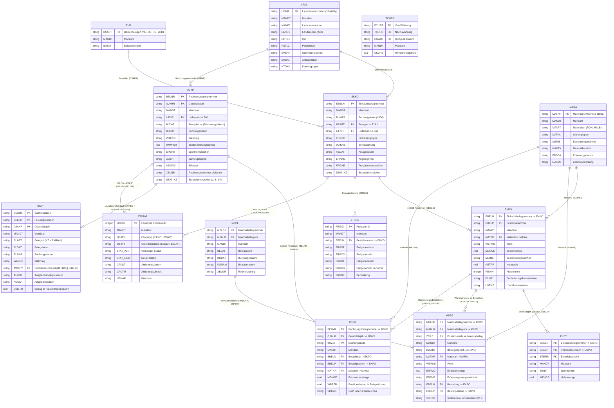

# Datenbankmodell: Purchase-to-Pay (ERP Legacy)

Dieses Dokument beschreibt das relationale Datenmodell des Purchase-to-Pay (P2P)-Kerns in der SQLite-Datenbank `data/erp_legacy.db`, basierend auf `data/schema.sql` sowie der tatsächlichen Datenbankstruktur.

---

## 1. Übersicht der 14 Kern-Tabellen

| Tabelle | SAP-Kürzel | Fachliche Bezeichnung | Zeilenanzahl (DB) | Primärschlüssel (PK) |
|---|---|---|---|---|
| **LFA1** | Kreditorenstamm | Lieferanten-Stammdaten | 340 | `LIFNR` |
| **MARA** | Materialstamm | Material-Stammdaten allgemein | 2.000 | `MATNR` |
| **T161** | Belegarten Einkauf | Customizing-Tabelle Bestellarten | 4 | `BSART` |
| **TCURR** | Wechselkurse | Währungsumrechnungskurse | 8 | `FCURR, TCURR, GDATU` |
| **EKKO** | Einkaufsbelegkopf | Bestellung Kopfdaten | 15.000 | `EBELN` |
| **EKPO** | Einkaufsbelegposition | Bestellung Positionsdaten | 52.846 | `EBELN, EBELP` |
| **EKET** | Einteilungen | Lieferabrufe / Liefertermine | 52.846 | `EBELN, EBELP, ETENR` |
| **MKPF** | Materialbelegkopf | Wareneingang Kopfdaten | 12.244 | `MBLNR, MJAHR` |
| **MSEG** | Materialbelegsegment | Wareneingang Positionen | 41.017 | `MBLNR, MJAHR, ZEILE` |
| **RBKP** | Rechnungskopf | Eingangsrechnung Kopfdaten | 8.982 | `BELNR, GJAHR` |
| **RSEG** | Rechnungsposition | Eingangsrechnung Positionen | 30.108 | `BELNR, GJAHR, BUZEI` |
| **BKPF** | Buchhaltungsbeleg | Finanzbuchhaltung Belegkopf / Zahlung | 2.949 | `BUKRS, BELNR, GJAHR` |
| **ZTFRG** | Freigabe-Workflow | Custom-Tabelle Bestellfreigaben | 14.401 | `FRGID` |
| **ZTSTAT** | Statushistorie | Custom-Audit-Log für Statuswechsel | 77.330 | `LOGID` |

---

## 2. Mermaid Entity-Relationship-Diagramm (ERD)



---

## 3. Die fachlichen Kernbeziehungen (Join-Pfade)

### 3.1 Three-Way Match (Bestellung -> Wareneingang -> Rechnung)
Das Herzstück des P2P-Prozesses ist der Abgleich zwischen Bestellung, Wareneingang und Eingangsrechnung:

1. **Bestellung (`EKKO`/`EKPO`)**:
   - `EKKO.EBELN = EKPO.EBELN`
2. **Wareneingang (`MKPF`/`MSEG`)**:
   - Verknüpfung zur Bestellposition über:
     ```sql
     MSEG.EBELN = EKPO.EBELN AND MSEG.EBELP = EKPO.EBELP
     ```
   - Standard-Bewegungsart für Wareneingang zur Bestellung: `MSEG.BWART = '101'`.
3. **Rechnungseingang (`RBKP`/`RSEG`)**:
   - Verknüpfung zur Bestellposition über:
     ```sql
     RSEG.EBELN = EKPO.EBELN AND RSEG.EBELP = EKPO.EBELP
     ```

### 3.2 Ausgleich & Bezahlung (`RBKP` -> `BKPF`)
Ein Buchhaltungsbeleg (`BKPF`) verknüpft sich über das zusammengesetzte Feld `AWKEY`:
```sql
BKPF.AWKEY = RBKP.BELNR || RBKP.GJAHR
```
- Zahllauf-Belege haben `BKPF.BLART = 'KZ'`.
- Eine Rechnung gilt als **vollständig ausgeglichen / bezahlt**, sobald `BKPF.AUGBL` gefüllt ist.

### 3.3 Freigaben & Historie (`ZTFRG` / `ZTSTAT`)
- **Freigaben**: `ZTFRG.EBELN = EKKO.EBELN` dokumentiert, wer wann welche Freigabestufe erteilt hat.
- **Statusverlauf**: `ZTSTAT` protokolliert Statuswechsel polymorph:
  - Für Bestellungen: `ZTSTAT.OBJTY = 'EKKO' AND ZTSTAT.OBJKY = EKKO.EBELN`
  - Für Rechnungen: `ZTSTAT.OBJTY = 'RBKP' AND ZTSTAT.OBJKY = RBKP.BELNR`

---

## 4. Häufige Fallstricke bei Abfragen

1. **Gültige Bestellpositionen (`EKPO`)**:
   - Gelöschte Positionen haben `LOEKZ IS NOT NULL` (z. B. `'L'` oder `'X'`).
   - Abgeschlossene Lieferungen tragen `ELIKZ = 'X'`.
   - Der Positionswert errechnet sich aus `(NETPR * MENGE / PEINH)`. Achtung: `PEINH` kann `> 1` sein (z. B. Preis pro 100 oder 1000 Stück).
2. **Rechnungsprüfung / Hängende Rechnungen (`RBKP`)**:
   - Nach der Systemharmonisierung 2019 bedeutet `RBKP.STAT_KZ = '34'`: *Rechnung in Prüfung / blockiert* (2.227 Belege).
   - Das Feld `SPERR = 'X'` kennzeichnet Prüfungssperren.
   - `ZLSPR` enthält Zahlungssperren im Zahllauf.
3. **Lieferantensperren (`LFA1`)**:
   - `LFA1.SPERR = 'X'` sperrt den Lieferanten generell für Neubestellungen.
